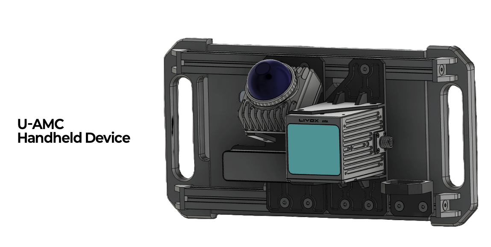
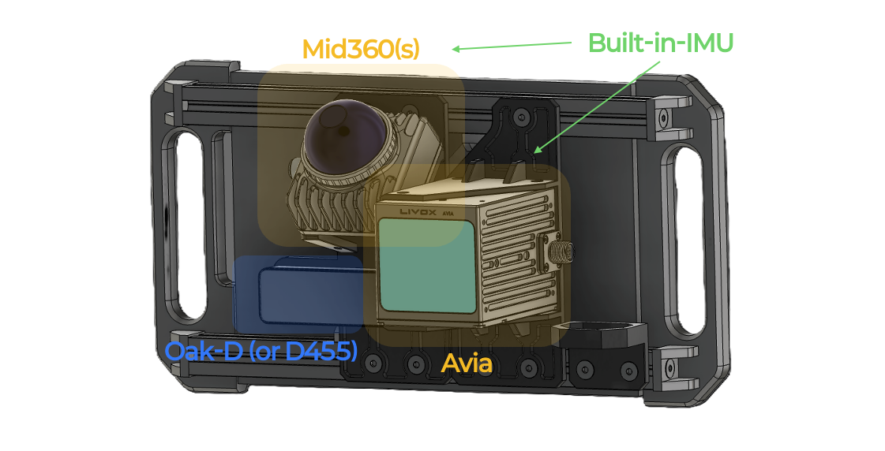
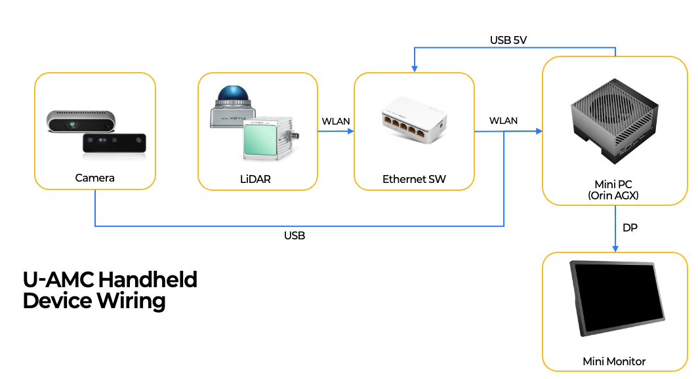

# UAMHD — Universal Adapter for Mapping Handheld Device

## 1. Introduction
This repository provides the CAD files of UAMHD (Universal Adapter for Mapping Handheld Device), a handheld device used for <PURPOSE — e.g. "sampling LiDAR-Inertial-Visual data">.

All printable modules are designed to be [*FDM (Fused Deposition Modeling)*](https://en.wikipedia.org/wiki/Fused_filament_fabrication) printable.

We release the printable parts as **STL** files (under `release/`), which can be sliced and printed directly, together with the [bill of materials](./BOM.md) listing the off-the-shelf components you need to source. Editable CAD source is **not** included. Scripts to bring up the sensors and record data live under `setup/` (see §4).

**Designer**: U-AMC (Jason Kim)

<div align="center">

</div>

## 2. Guide to installation
### 2.1 Assembly instruction
The assembly instructions are shown below. Each module is labeled with the name of its corresponding STL file.

<div align="center">

</div>

### 2.2 Electronic connection
The electronic-connection guide:

<div align="center">

</div>
<!-- TODO: add pics/ee_connection.png (wiring / power diagram) -->

## 3. Printing the parts
All printable parts are provided as ready-to-print **STL** meshes under `release/`. Import them directly into your slicer (Cura, PrusaSlicer, etc.) and print — no CAD software required.

> Editable CAD source is not distributed with this release; only the STL meshes and the [bill of materials](./BOM.md) are provided.

## 4. Software setup (data acquisition)
The `setup/` directory holds the scripts that bring up the sensors and record data on the onboard computer. They assume **Ubuntu 22.04 + ROS 2 Humble** and target a sensor stack of Livox LiDAR(s) + a Luxonis Oak-D Pro camera, time-synced over PTP and transported with Fast DDS.

### 4.1 Prerequisites
- Ubuntu 22.04, ROS 2 Humble installed at `/opt/ros/humble`.
- A ROS 2 workspace under `setup/` with a `src/` folder containing the sensor drivers:
  ```bash
  cd setup
  git clone https://github.com/Livox-SDK/livox_ros_driver2.git  src/livox_ros_driver2
  git clone https://github.com/luxonis/depthai-ros.git           src/depthai-ros
  # plus any older-model driver you need (e.g. livox_ros2_driver)
  ```
- A wired NIC connected to the LiDAR(s). The PTP script defaults to interface `eno1` — edit `IFACE` in `setup/init_ptp_master.sh` if yours differs.

### 4.2 One-time setup (run once per machine)
Run these in order. Each is idempotent and several use `sudo`.

| Step | Script | What it does |
| :--: | :----- | :----------- |
| 1 | `./setup/setup_depthai.sh` | Installs depthai + ROS 2 apt dependencies and checks out the `humble` branch of `depthai-ros`. |
| 2 | `./setup/setup_fastdds.sh` | Tunes kernel UDP socket buffers (persistent via `/etc/sysctl.d`) so large pointcloud/image messages don't drop. Requires `sudo`. |
| 3 | `./setup/build_ws.sh` | Prepares the Livox driver for ROS 2 and builds the workspace with `colcon`. Source the result with `source setup/install/setup.bash`. |

```bash
cd setup
./setup_depthai.sh      # install dependencies
./setup_fastdds.sh      # tune network buffers (sudo)
./build_ws.sh           # build the workspace
```

### 4.3 Recording a session (every run)
1. **Bring up the sensors.** This initializes the PTP time-sync master, configures Fast DDS, sources the workspace, and launches the LiDAR + camera drivers. Leave it running; `Ctrl+C` shuts everything down cleanly.
   ```bash
   ./setup/sensor_bringup.sh
   ```
2. **Record a bag** (in a second terminal). First find your Livox topic names — they are unique per unit — then set them and record:
   ```bash
   ros2 topic list | grep livox          # discover your device's topic IDs
   LIDAR_A=<your_id_1> LIDAR_B=<your_id_2> ./setup/bag_record.sh
   ```
   Output is written to a timestamped `handheld_<date>_<time>/` bag directory (override with `OUT=...`).

> The recorded topics (`bag_record.sh`) and the launched drivers/models (`sensor_bringup.sh`) are specific to this sensor set. Edit those two scripts to match your LiDAR models, camera, and topic names.

## 5. Bill of Materials

### → [View full BOM](./BOM.md)

The BOM lists all printable parts (with links to their STL files) and the off-the-shelf components required to build UAMHD. Availability of purchased components is not guaranteed.

## 6. License
This work — CAD/STL files, documentation, images, and setup scripts — is released under the
**[Creative Commons Attribution-NonCommercial-ShareAlike 4.0 International (CC BY-NC-SA 4.0)](https://creativecommons.org/licenses/by-nc-sa/4.0/)** license.
See the [`LICENSE`](./LICENSE) file for details.

In short: you may use, modify, and share this work **non-commercially**, with **attribution**, and any
derivatives must be shared under the **same license**. **Commercial use requires separate permission** —
contact marimo117@urobotics.ai.

If you use this design in academic research, please cite our work.
The associated paper is currently under review — citation will be added here upon acceptance.

For technical issues, contact marimo117@urobotics.ai.
